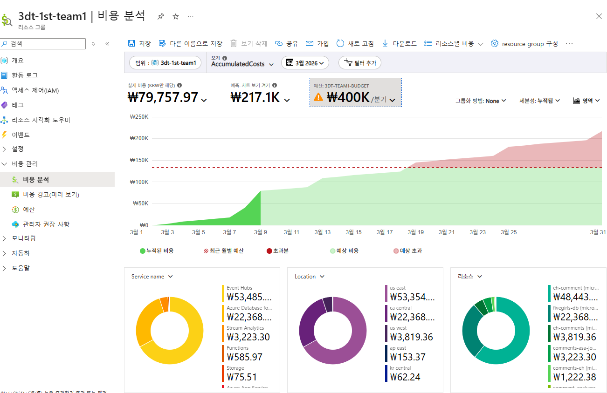

[🇰🇷 한국어](./README_KO.md) | [🇺🇸 English](./README_EN.md)

# 🎯 Pickly — Ad Intelligence Platform

> **협찬 광고, 데이터로 증명하세요.**  
> 유튜브 협찬 영상의 댓글·조회수·반응을 수집하고 AI로 분석하는 인텔리전스 플랫폼입니다.

---

## 📌 프로젝트 개요

**Pickly**는 인플루언서(유튜버 협찬) 캠페인을 운영하는 브랜드 마케터와 마케팅 대행사를 위한 클라우드 네이티브 B2B SaaS 플랫폼입니다.  
유튜브 댓글과 플랫폼 리뷰(네이버쇼핑, 올리브영)를 자동 수집하고, Azure OpenAI(GPT-4o-mini + text-embedding-3-large)를 활용한 감성 분석을 통해 실시간 캠페인 성과 대시보드를 제공합니다.

---

## 🏗 전체 시스템 아키텍처

**데이터 흐름**

```
YouTube API  →  run_collect() + run_processing()  →  PostgreSQL
                (6시간마다 Timer Trigger)

네이버쇼핑/올리브영 크롤링  →  PostgreSQL
                (12시간마다 Timer Trigger, 50~150건)

PostgreSQL  ↔  Azure OpenAI (감성 분석)
PostgreSQL  →  Flask 대시보드
```

| 단계 | 구성 요소 | 상세 |
|------|-----------|------|
| 수집 | Azure Functions (`youtube-comments`) | `run_collect()` + `run_processing()` · 6시간마다 Timer Trigger |
| 수집 | Azure Functions (`platform-review-function-0309`) | 네이버쇼핑 / 올리브영 크롤링 · 12시간마다 · 50~150건 |
| AI 분석 | Azure Functions (`comment-analyzer`) | GPT-4o-mini 감성 분석 + 구매 의도 + 위기 감지 |
| 알림 | Azure Functions (`alert-func-v2`) | 위기 댓글 감지 시 실시간 알림 |
| 저장 | Azure Database for PostgreSQL (`fivegirls-db`) | 3-레이어 스키마 (수집 / 분석 / 집계) |
| 시각화 | Flask App Service (`pickly-dashboard`) | KPI · VOC · Sentiment Trend · AI 어시스턴트 |
| CI/CD | GitHub Actions | `front` 브랜치 push 시 자동 빌드 및 배포 |

---

## 🗄 데이터베이스 스키마

3단계 레이어로 데이터 품질을 단계적으로 관리합니다.

### ① 수집 레이어 | Raw Data


### ② 분석 레이어 | Cleansing & Sentiment


### ③ 집계 레이어 | Metrics & Output


---

## ☁️ Azure 리소스 구성

### 리소스 그룹 전체 현황 (`3dt-1st-team1`)


### Azure OpenAI 모델 배포


### PostgreSQL — fivegirls-db


- 구성: Burstable B2ms · vCore 2개 · RAM 8GiB · Storage 32GiB
- PostgreSQL 버전: 16.12 · 위치: Canada Central

---

## 🚀 Azure Functions


---

## 🚢 배포 구성

### App Service 개요


- URL: `pickly-dashboard.azurewebsites.net`
- 런타임: Python 3.11 · Linux · App Service B1

### 배포 센터 — GitHub Actions CI/CD


- 조직: `miyeon00` / 리포지토리: `MS_FIVE_GIRLS` / 브랜치: `front`
- `front` 브랜치 push 시 자동 빌드 및 배포

### 환경 변수


```
DB_HOST / DB_NAME / DB_PASSWORD / DB_PORT / DB_USER
OPENAI_API_VERSION / OPENAI_EMBEDDINGS_DEPLOYMENT
OPENAI_ENDPOINT / OPENAI_GPT_MODEL / OPENAI_KEY
SECRET_KEY
```

---

## 📊 대시보드 화면

### 1. 로그인 / 회원가입


KO · EN 다국어 지원. 역할 기반 접근 제어(브랜드 마케터 / 대행사 / 관리자).

---

### 2. 제품 목록


총 제품 수·영상 수·조회수·분석 댓글 수를 한눈에 확인합니다. 제품 클릭 시 캠페인 대시보드로 이동합니다.

---

### 3. Performance Hub — 실시간 KPI


- 위기 댓글 배너 + 실시간 수집 상태 표시
- KPI: 총 조회수 **73만** · 전체 댓글 **2,850** · 긍정률 **89.5%** · 구매 의도 **1,272건** · 위기 댓글 **158건**
- **AI INSIGHTS** 티커: GPT-4o-mini 기반 실행 가능한 인사이트 자동 생성
- 우측 패널: RAG 기반 AI 데이터 어시스턴트 챗봇

---

### 4. KPI 요약 — 영상별 비교


긍정률·구매 의도·위기 댓글·협업 점수를 영상 간 비교합니다. 최고/위험 배지 자동 표시.

---

### 5. 플랫폼 리뷰 & Sentiment Trend


- 캠페인 전후 리뷰 점수 비교 (네이버쇼핑 vs. 올리브영)
- 시간대별(24h 이내 / 1~3일 / 3~7일 / 7일 이상) 긍부정 추이 면적 차트
- 💡 캠페인 이후 평균 평점 **+0.03점** 상승, 7일 이후 구간에 반응 집중(4,792건)

---

### 6. VOC 분석 — 강점/약점 키워드


| 구분 | Top 키워드 |
|------|-----------|
| 긍정 VOC | 다크닝(586) · 21호(460) · 모공(447) · 건조(378) · 매트(351) |
| 부정 VOC | 건조(14) · 지성(14) · 21호(11) · 모공(10) · 다크닝(8) |

키워드 클릭 시 관련 댓글이 우측 패널에 표시됩니다.

---

### 7. Audience & Inflow — 시청자 유형 분석


- **시청자 페르소나**: Loyal 25.2% · Newbie 26.2% · None 48.6%
- **댓글 유입 시점**: Early 74.9% (긍정 94.1%) · Expansion 18.2% · Steady 6.8%

---

### 8. Total Comments — 전체 댓글


전체 댓글 목록을 긍정/부정/위기/A·B 테스트 필터로 조회합니다. 댓글별 감성 라벨·위기도·유입 시점이 표시됩니다.

---


## 💰 비용 분석 (2026년 3월)



| 서비스 | 비용 (KRW) |
|--------|-----------|
| Event Hubs (`eh-comment`) | ₩48,443 |
| Azure Database for PostgreSQL | ₩22,368 |
| Stream Analytics | ₩3,819 |
| Functions | ₩585 |
| Storage | ₩75 |
| **실제 누적 비용** | **₩79,757** |
| 예상 비용 (3월 말) | ₩217,100 |
| 분기 예산 | ₩400,000 |

> ⚠️ Event Hubs가 전체의 약 60%를 차지합니다. 소비 기반 티어 전환 또는 보존 기간 단축으로 최적화 가능.

---

## 📦 기술 스택


---


## 📄 라이선스

본 프로젝트는 Microsoft AI School 프로그램의 교육 및 포트폴리오 목적으로 개발되었습니다.  
수집된 데이터는 수집일로부터 6개월 후 자동으로 삭제됩니다.
