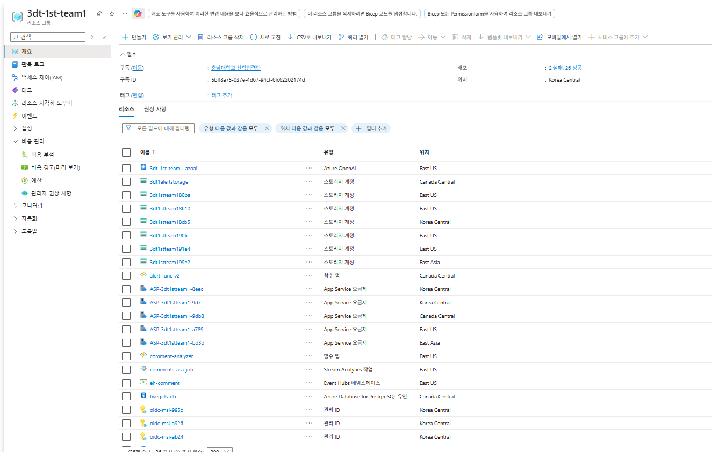

[🇰🇷 한국어](./README.md) | [🇺🇸 English](./README_EN.md)

# 🎯 Pickly — Ad Intelligence Platform

> **협찬 광고, 데이터로 증명하세요.**  
> 유튜브 협찬 영상의 댓글·조회수·반응을 수집하고 AI로 분석하는 인텔리전스 플랫폼입니다.

---

## 📌 프로젝트 개요

**Pickly**는 인플루언서(유튜버 협찬) 캠페인을 운영하는 브랜드 마케터와 마케팅 대행사를 위한 클라우드 네이티브 B2B SaaS 플랫폼입니다.

수만 건의 유튜브 댓글과 쇼핑몰 리뷰 속에 숨겨진 실제 구매 의도와 브랜드 위기 신호를 AI로 자동 포착하여 마케터의 의사결정을 지원합니다.

- **KcELECTRA**: 한국어 구어체·신조어에 특화된 모델로 수만 건의 댓글을 감성 분류(긍/부정/위기)
- **GPT-4o-mini**: 분류된 데이터를 바탕으로 실행 가능한 인사이트 요약 및 RAG 기반 챗봇 대응

> 비용 효율성과 속도가 중요한 단순 감성 분류는 KcELECTRA를, 복잡한 맥락 파악과 인사이트 도출은 GPT-4o-mini를 활용하는 하이브리드 AI 구조입니다.

---

## 🏗 전체 시스템 아키텍처

**데이터 흐름**

```
youtube_collect.py / naver_collect.py / oliveyoung_collect.py
        ↓ (Azure Functions · Timer Trigger)
   PostgreSQL (Raw Data)
        ↓ (comment-analyzer · Azure Functions · KcELECTRA)
   PostgreSQL (감성 분석)
        ↓ (Stream Analytics · 위기/바이럴 감지)
   alert-func-v2 → 실시간 알림
        ↓
   app.py (Flask · GPT-4o-mini)
```

| 단계 | 구성 요소 | 상세 |
|------|-----------|------|
| 수집 | `youtube_collect.py` | YouTube Data API 댓글 수집 · 6시간마다 Timer Trigger |
| 처리 | `youtube_processing.py` | 수집 데이터 전처리 · PostgreSQL 적재 |
| 수집 | `naver_collect.py` · `oliveyoung_collect.py` | 네이버쇼핑 / 올리브영 크롤링 · 12시간마다 · 50~150건 |
| 처리 | `platform_processing.py` | 플랫폼 리뷰 전처리 · PostgreSQL 적재 |
| 감정 분석 | `comment-analyzer` (Azure Functions) | KcELECTRA 감성 분류 · 구매 의도 · 위기 플래그 |
| 실시간 감지 | Stream Analytics (`comments-asa-job`) | 위기 댓글 급증 · 바이럴 급상승 감지 |
| 알림 | `alert-func-v2` (Azure Functions) | 위기/바이럴 조건 충족 시 웹훅 알림 |
| 시각화 | `app.py` (Flask) | 웹 대시보드 · GPT-4o-mini 인사이트 요약 · 음성 안내 |
| CI/CD | GitHub Actions | `front` 브랜치 push 시 자동 배포 |

### 🚨 실시간 감지 로직 (Stream Analytics)

**위기 감지 (CRISIS_ALERT)**

`HoppingWindow(hour, 24, 6)` — 중첩된 시간 범위를 분석하여 지속적인 위기 흐름을 추적하기 위해 활용. 24시간 데이터를 6시간마다 검사하여, 부정(`NEGATIVE`) + 위기 플래그(`crisis_flag = true`) 댓글이 10개 이상이면 즉시 웹훅 알림을 발송합니다. 여론이 급격히 악화되는 상황을 골든타임 내에 포착합니다.

**바이럴 급상승 감지 (VIRAL_SPIKE)**

`TumblingWindow` — 고정된 시간 간격의 데이터를 독립적으로 비교하여 급격한 수치 변화를 측정하기 위해 활용. 2개의 윈도우를 조인하여 이전 6시간 대비 현재 6시간 댓글 수가 **3배 초과(300%)** 시 알림을 발송합니다. 바이럴 시점을 정확히 감지하여 추가 프로모션 타이밍을 포착합니다.

---

## 🗄 데이터베이스 스키마

3단계 레이어로 데이터 품질을 단계적으로 관리합니다.

### ① 수집 레이어 | Raw Data


### ② 분석 레이어 | Cleansing & Sentiment


### ③ 집계 레이어 | Metrics & Output


---

## ☁️ Azure 리소스 구성

### 리소스 그룹 전체 현황 (`3dt-1st-team1`)



### Azure OpenAI 모델 배포


### PostgreSQL — fivegirls-db


- 구성: Burstable B2ms · vCore 2개 · RAM 8GiB · Storage 32GiB
- PostgreSQL 버전: 16.12 · 위치: Canada Central

---

## 🚀 Azure Functions


---

## 🚢 배포 구성

### App Service 개요


- URL: `pickly-dashboard.azurewebsites.net`
- 런타임: Python 3.11 · Linux · App Service B1

### 배포 센터 — GitHub Actions CI/CD


- 조직: `miyeon00` / 리포지토리: `MS_FIVE_GIRLS` / 브랜치: `front`
- `front` 브랜치 push 시 자동 빌드 및 배포

### 환경 변수


---

## 📊 대시보드 화면

### 1. 로그인 / 회원가입


KO · EN 다국어 지원. 역할 기반 접근 제어(브랜드 마케터 / 대행사 / 관리자).

---

### 2. 제품 목록


총 제품 수·영상 수·조회수·분석 댓글 수를 한눈에 확인합니다. 제품 클릭 시 캠페인 대시보드로 이동합니다.

---

### 3. Performance Hub — 실시간 KPI


- 위기 댓글 배너 + 실시간 수집 상태 표시
- KPI: 총 조회수 **73만** · 전체 댓글 **2,850** · 긍정률 **89.5%** · 구매 의도 **1,272건** · 위기 댓글 **158건**
- **AI INSIGHTS** 티커: GPT-4o-mini 기반 실행 가능한 인사이트 자동 생성
- 우측 패널: RAG 기반 AI 데이터 어시스턴트 챗봇

---

### 4. KPI 요약 — 영상별 비교


긍정률·구매 의도·위기 댓글·협업 점수를 영상 간 비교합니다. 최고/위험 배지 자동 표시.

---

### 5. 플랫폼 리뷰 & Sentiment Trend


- 캠페인 전후 리뷰 점수 비교 (네이버쇼핑 vs. 올리브영)
- 시간대별(24h 이내 / 1~3일 / 3~7일 / 7일 이상) 긍부정 추이 면적 차트
- 💡 캠페인 이후 평균 평점 **+0.03점** 상승, 7일 이후 구간에 반응 집중(4,792건)

---

### 6. VOC 분석 — 강점/약점 키워드


| 구분 | Top 키워드 |
|------|-----------|
| 긍정 VOC | 다크닝(586) · 21호(460) · 모공(447) · 건조(378) · 매트(351) |
| 부정 VOC | 건조(14) · 지성(14) · 21호(11) · 모공(10) · 다크닝(8) |

키워드 클릭 시 관련 댓글이 우측 패널에 표시됩니다.

---

### 7. Audience & Inflow — 시청자 유형 분석


- **시청자 페르소나**: Loyal 25.2% · Newbie 26.2% · None 48.6%
- **댓글 유입 시점**: Early 74.9% (긍정 94.1%) · Expansion 18.2% · Steady 6.8%

---

### 8. Total Comments — 전체 댓글


전체 댓글 목록을 긍정/부정/위기/A·B 테스트 필터로 조회합니다. 댓글별 감성 라벨·위기도·유입 시점이 표시됩니다.

---

## 📦 기술 스택


