[🇰🇷 한국어](./README_KO.md) | [🇺🇸 English](./README_EN.md)

# 🎯 Pickly — Ad Intelligence Platform

> **협찬 광고, 데이터로 증명하세요.**  
> 유튜브 협찬 영상의 댓글·조회수·반응을 자동 수집하고 AI로 분석하는 인텔리전스 플랫폼입니다.

---

## 📌 프로젝트 개요

**Pickly**는 인플루언서(유튜버 협찬) 캠페인을 운영하는 브랜드 마케터와 마케팅 대행사를 위한 클라우드 네이티브 B2B SaaS 플랫폼입니다.

수만 건의 유튜브 댓글과 쇼핑몰 리뷰 속에 숨겨진 실제 구매 의도와 브랜드 위기 신호를 AI로 자동 포착하여 마케터의 의사결정을 지원합니다.

- **KcELECTRA**: 한국어 구어체·신조어에 특화된 모델로 댓글을 감성 분류(긍/부정/위기)
- **GPT-4o-mini**: 분류된 데이터를 바탕으로 실행 가능한 인사이트 요약 및 RAG 기반 챗봇 대응

> 비용 효율성과 속도가 중요한 단순 감성 분류는 KcELECTRA를, 복잡한 맥락 파악과 인사이트 도출은 GPT-4o-mini를 활용하는 하이브리드 AI 구조입니다.

---

## 🏗 전체 시스템 아키텍처

```
youtube_collect.py / naver_collect.py / oliveyoung_collect.py
        ↓  (Azure Functions · Timer Trigger)
   PostgreSQL (Raw Data)
        ↓  (Azure Functions · KcELECTRA)
   PostgreSQL (감성 분석 · 위기 플래그)
        ↓
   alert-func-v2 → 위기 조건 충족 시 웹훅 알림
        ↓
   app.py (Flask · GPT-4o-mini)
```

| 단계 | 구성 요소 | 상세 |
|------|-----------|------|
| 수집 | `youtube_collect.py` | YouTube Data API 댓글 수집 · 6시간마다 Timer Trigger |
| 처리 | `youtube_processing.py` | 수집 데이터 전처리 · PostgreSQL 적재 |
| 수집 | `naver_collect.py` · `oliveyoung_collect.py` | 네이버쇼핑 / 올리브영 크롤링 · 12시간마다 · 50~150건 |
| 처리 | `platform_processing.py` | 플랫폼 리뷰 전처리 · PostgreSQL 적재 |
| 감성 분석 | `comment-analyzer` (Azure Functions) | KcELECTRA 감성 분류 · 구매 의도 · 위기 플래그 (`sentiment_neg > 0.7`) |
| 알림 | `alert-func-v2` (Azure Functions) | 위기 플래그 누적 시 웹훅 알림 발송 |
| 시각화 | `app.py` (Flask) | 웹 대시보드 · GPT-4o-mini 인사이트 요약 · RAG 챗봇 |
| CI/CD | GitHub Actions | `front` 브랜치 push 시 자동 배포 |

---

## 🗄 데이터베이스 스키마

3단계 레이어로 데이터 품질을 단계적으로 관리합니다.

### ① 수집 레이어 | Raw Data

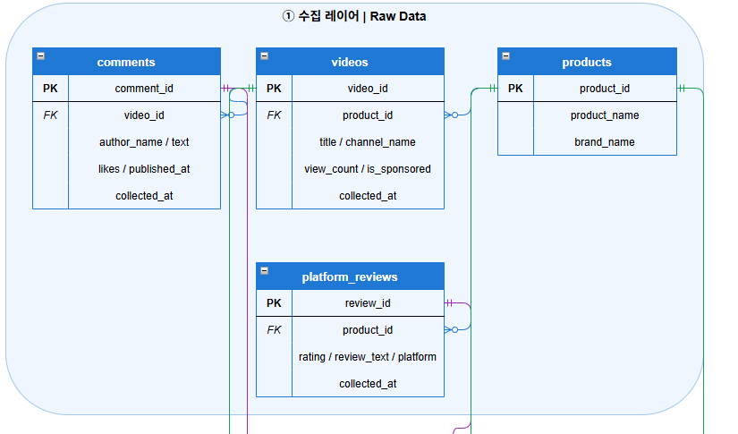

- `comments` — YouTube 댓글·대댓글 원본 (작성자명 SHA-256 비식별화)
- `videos` — 협찬 영상 메타데이터 (조회수·좋아요·댓글수 UPSERT)
- `products` — 제품/브랜드 정보
- `platform_reviews` — 올리브영/네이버쇼핑 리뷰 원본

### ② 분석 레이어 | Cleansing & Sentiment

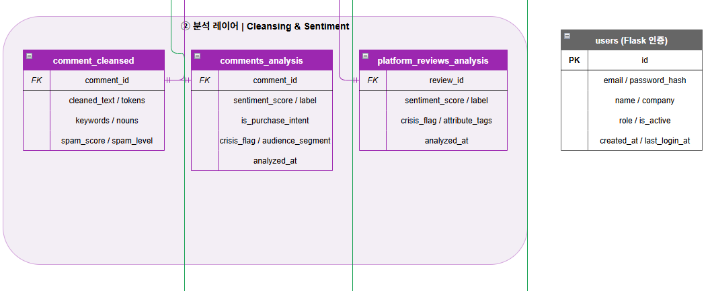

- `comment_cleansed` — 정제 텍스트, 키워드, 스팸 점수
- `comments_analysis` — 감성 점수/라벨, 구매 의도, 위기 플래그, 시청자 세그먼트
- `platform_reviews_analysis` — 리뷰 감성 분석, 속성 태그
- `users` — Flask 인증용 사용자 테이블

### ③ 집계 레이어 | Metrics & Output

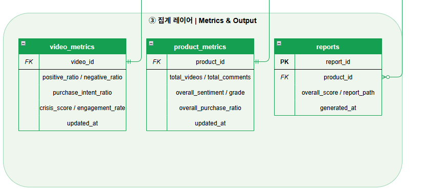

- `video_metrics` — 영상별 긍/부정 비율, 구매의도 비율, 위기 점수
- `product_metrics` — 제품별 통합 감성 등급
- `reports` — PDF 리포트 생성 이력

---

## 🔍 데이터 수집 상세

### YouTube 댓글 수집 (`youtube_collect.py`)

YouTube Data API v3를 사용하여 협찬 영상의 댓글과 대댓글을 전체 수집합니다.

- **쿼터 관리**: 일일 10,000 유닛 한도 추적, 초과 시 자동 중단
- **대댓글 완전 수집**: `totalReplyCount > fetched` 조건으로 누락 없이 추가 수집
- **작성자 비식별화**: 고정 salt + SHA-256 마스킹, 동일 유저 추적은 가능하되 원본 복구 불가
- **업로더 댓글 제외**: `channel_id` 비교로 영상 업로더 댓글 필터링
- **Bulk INSERT**: `execute_values`로 1,000건 단위 배치 저장
- **트랜잭션**: 영상 단위 commit/rollback, 일부 실패 시 다음 영상으로 진행

### 올리브영 리뷰 수집 (`oliveyoung_collect.py`)

- `curl_cffi`로 Chrome 브라우저 지문을 모방하여 봇 탐지 우회
- 올리브영 모바일 내부 API(`/review/api/v2/reviews`) 직접 호출
- 보안 쿠키 발급을 위해 상품 페이지 선접속 후 API 요청

### 네이버쇼핑 리뷰 수집 (`naver_collect.py`)

- `Selenium` + `webdriver_manager`로 JavaScript 렌더링 페이지 크롤링
- `hashlib.sha256(content)`으로 콘텐츠 기반 고유 ID 생성, 중복 수집 방지
- `ON CONFLICT (review_id) DO NOTHING`으로 DB 레벨 중복 제어

---

## 🤖 AI 분석 상세

### 감성 분석 (`comments_analyzer.py`)

KcELECTRA 파인튜닝 모델로 댓글을 POSITIVE / NEGATIVE로 분류합니다.

- **위기 감지**: `sentiment_label == NEGATIVE` AND `sentiment_neg > 0.7` 조건으로 `crisis_flag` 설정
- **가중 감성**: `sentiment_score × log(1 + likes)`로 좋아요 수를 반영한 영향력 지수 산출
- **배치 처리**: 64건 단위로 묶어 모델에 전달, 분석 즉시 DB 저장
- **폴백**: 모델 로드 실패 시 키워드 기반 단순 분류로 자동 전환

### 구매 의도 분류 (`purchase_intent_model_v4.py`)

GradientBoosting + TF-IDF + 규칙 피처를 결합한 4단계 분류 모델입니다.

| 레벨 | 라벨 | 정의 | DB 저장 |
|------|------|------|---------|
| 0 | NONE | 의미없음/스팸 | `is_purchase_intent = FALSE` |
| 1 | L1 | 단순 긍정/칭찬 | `is_purchase_intent = FALSE` |
| 2 | L2 | 탐색/고민 | `is_purchase_intent = TRUE` |
| 3 | L3 | 구매/전환 (즉시 + 대기) | `is_purchase_intent = TRUE` |

- **피처**: TF-IDF char n-gram (2~4) + word n-gram (1~2) + 규칙 피처 (부정 표현, 감탄사, 시간성)
- **학습**: 5-Fold Stratified CV · GridSearchCV 하이퍼파라미터 탐색 지원

---

## ☁️ Azure 리소스 구성

### Azure OpenAI 모델 배포

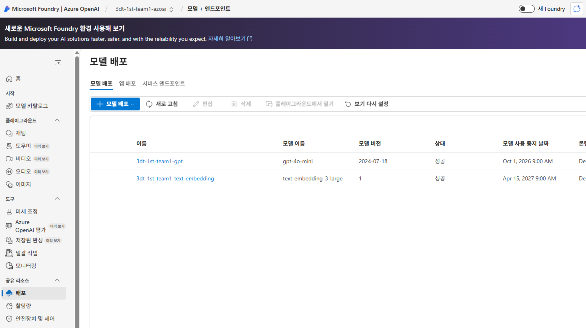

| 배포 이름 | 모델 | 버전 |
|----------|------|------|
| `3dt-1st-team1-gpt` | gpt-4o-mini | 2024-07-18 |
| `3dt-1st-team1-text-embedding` | text-embedding-3-large | 1 |

### PostgreSQL — fivegirls-db

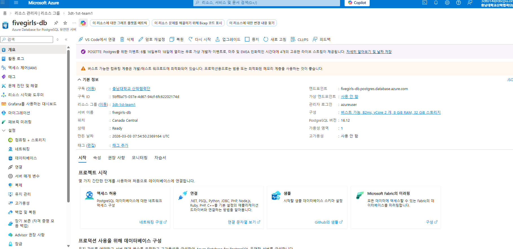

- 구성: Burstable B2ms · vCore 2개 · RAM 8GiB · Storage 32GiB
- PostgreSQL 버전: 16.12 · 위치: Canada Central

---

## 🚀 Azure Functions

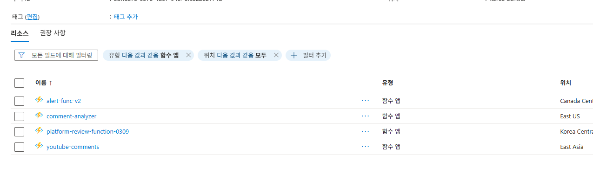

| 함수 앱 | 트리거 | 역할 |
|---------|--------|------|
| `youtube-comments` | Timer (6시간) | YouTube Data API 수집 + 전처리 파이프라인 |
| `platform-review-function-0309` | Timer (12시간) | 올리브영/네이버쇼핑 크롤링 |
| `comment-analyzer` | Timer | KcELECTRA 감성 분석 + 구매 의도 + 위기 플래그 |
| `alert-func-v2` | 이벤트 | 위기 플래그 누적 시 웹훅 알림 발송 |

---

## 🚢 배포 구성

### App Service 개요

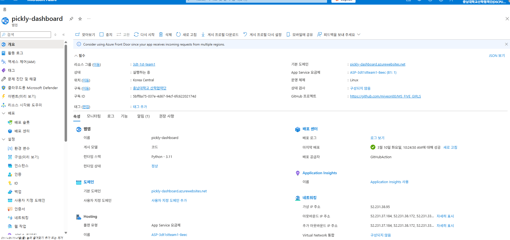

- URL: `pickly-dashboard.azurewebsites.net`
- 런타임: Python 3.11 · Linux · App Service B1

### 배포 센터 — GitHub Actions CI/CD

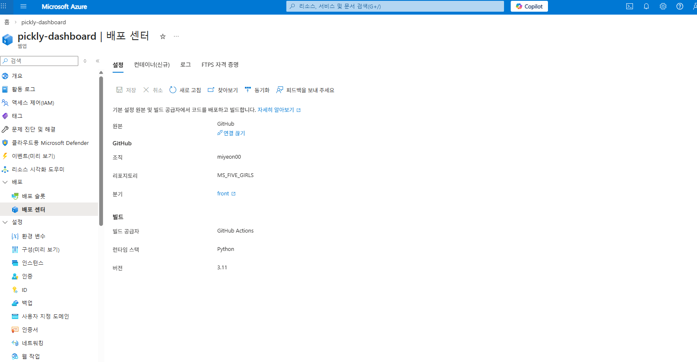

- 조직: `miyeon00` / 리포지토리: `MS_FIVE_GIRLS` / 브랜치: `front`
- `front` 브랜치 push 시 자동 빌드 및 배포

### 환경 변수

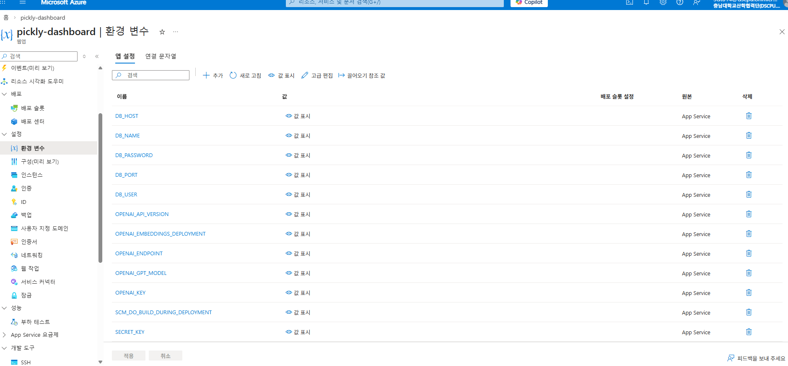

```
DB_HOST / DB_NAME / DB_PASSWORD / DB_PORT / DB_USER
OPENAI_API_VERSION / OPENAI_EMBEDDINGS_DEPLOYMENT
OPENAI_ENDPOINT / OPENAI_GPT_MODEL / OPENAI_KEY
YOUTUBE_API_KEY / MASK_SALT / SECRET_KEY
```

---

## 📊 대시보드 화면

### 1. 로그인 / 회원가입

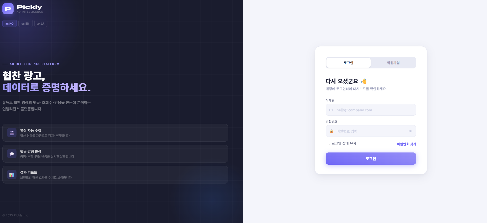

KO · EN · JA 다국어 지원. 역할 기반 접근 제어(브랜드 마케터 / 대행사 / 관리자).

---

### 2. 제품 목록

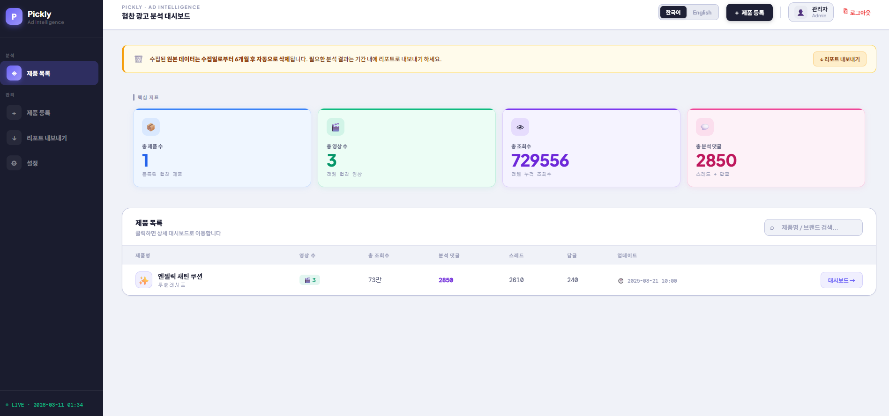

총 제품 수·영상 수·조회수·분석 댓글 수를 한눈에 확인합니다. 제품 클릭 시 캠페인 대시보드로 이동합니다.

---

### 3. Performance Hub — 실시간 KPI

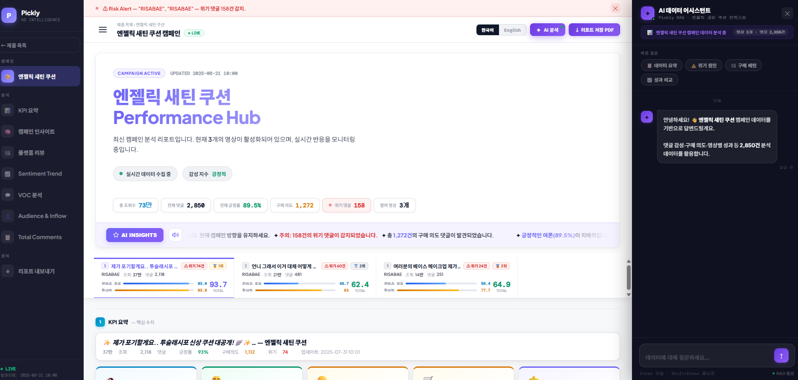

- 위기 댓글 배너 + 수집 상태 표시
- KPI: 총 조회수 **73만** · 전체 댓글 **2,850** · 긍정률 **89.5%** · 구매 의도 **1,272건** · 위기 댓글 **158건**
- AI INSIGHTS 티커: GPT-4o-mini 기반 인사이트 자동 생성
- 우측 패널: RAG 기반 AI 데이터 어시스턴트 챗봇

---

### 4. KPI 요약 — 영상별 비교

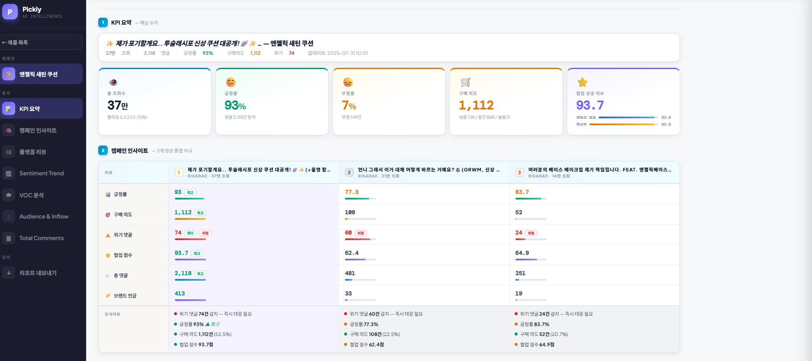

긍정률·구매 의도·위기 댓글·협업 점수를 영상 간 비교합니다.

---

### 5. 플랫폼 리뷰 & Sentiment Trend

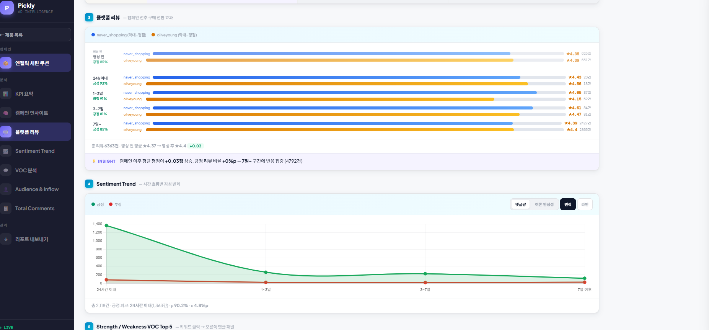

- 캠페인 전후 리뷰 점수 비교 (네이버쇼핑 vs. 올리브영)
- 시간대별(24h 이내 / 1~3일 / 3~7일 / 7일 이상) 긍부정 추이 면적 차트
- 캠페인 이후 평균 평점 **+0.03점** 상승, 7일 이후 구간에 반응 집중(4,792건)

---

### 6. VOC 분석 — 강점/약점 키워드

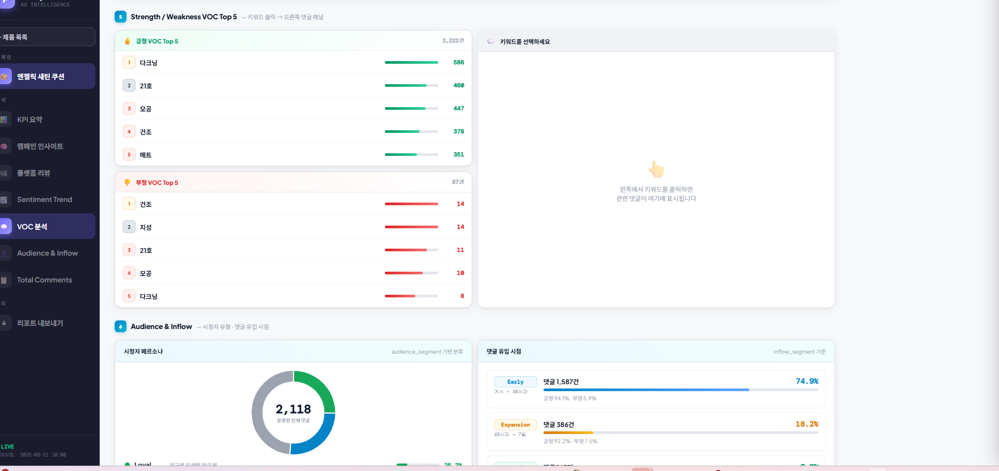

| 구분 | Top 키워드 |
|------|-----------|
| 긍정 VOC | 다크닝(586) · 21호(460) · 모공(447) · 건조(378) · 매트(351) |
| 부정 VOC | 건조(14) · 지성(14) · 21호(11) · 모공(10) · 다크닝(8) |

키워드 클릭 시 관련 댓글이 우측 패널에 표시됩니다.

---

### 7. Audience & Inflow

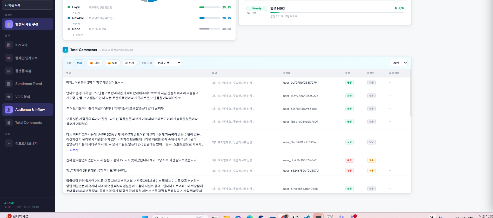

- 시청자 페르소나: Loyal 25.2% · Newbie 26.2% · None 48.6%
- 댓글 유입 시점: Early 74.9% (긍정 94.1%) · Expansion 18.2% · Steady 6.8%

---

### 8. Total Comments — 전체 댓글

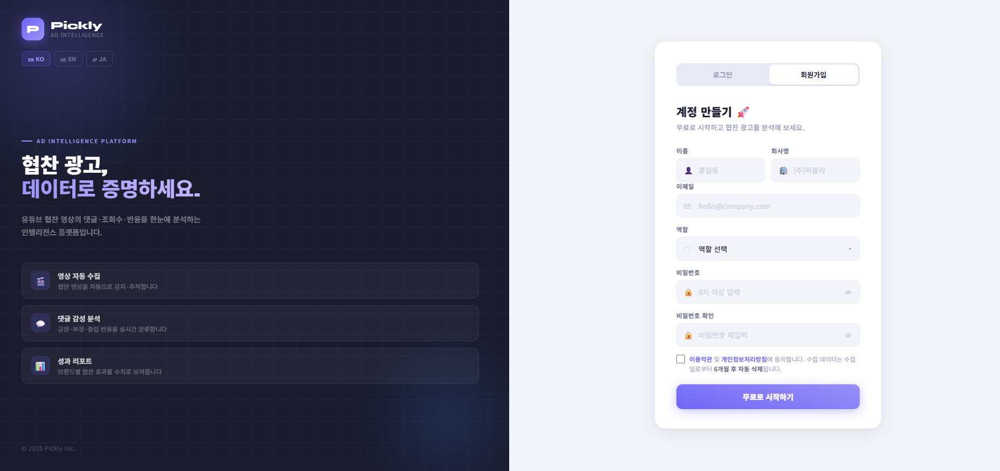

전체 댓글 목록을 긍정/부정/위기 필터로 조회합니다. 댓글별 감성 라벨·위기도·유입 시점이 표시됩니다.

---

## 🛠 로컬 실행

```bash
git clone https://github.com/miyeon00/MS_FIVE_GIRLS.git
cd MS_FIVE_GIRLS
git checkout front

python -m venv venv
source venv/bin/activate  # Windows: venv\Scripts\activate
pip install -r requirements.txt

cp .env.example .env
# .env에 DB_HOST, YOUTUBE_API_KEY, OPENAI_KEY 등 입력

flask run
```

### 환경 변수 (`.env`)

```env
DB_HOST=fivegirls-db.postgres.database.azure.com
DB_NAME=<데이터베이스명>
DB_USER=azureuser
DB_PASSWORD=<비밀번호>
DB_PORT=5432

YOUTUBE_API_KEY=<YouTube Data API v3 키>
MASK_SALT=<작성자 비식별화용 salt>

OPENAI_ENDPOINT=https://<your-openai>.openai.azure.com/
OPENAI_KEY=<API 키>
OPENAI_GPT_MODEL=3dt-1st-team1-gpt
OPENAI_EMBEDDINGS_DEPLOYMENT=3dt-1st-team1-text-embedding
OPENAI_API_VERSION=2024-02-01

SECRET_KEY=<Flask 시크릿 키>
```

---

## 📦 기술 스택


---

## 👤 담당 파트

데이터 수집 파이프라인 (YouTube Data API · 올리브영 · 네이버쇼핑 크롤링) ·  
댓글/리뷰 전처리 (스팸 필터링 · 형태소 분석 · DB 적재) ·  
Flask 웹 대시보드 (KPI · VOC · Sentiment Trend · AI 어시스턴트 UI)
